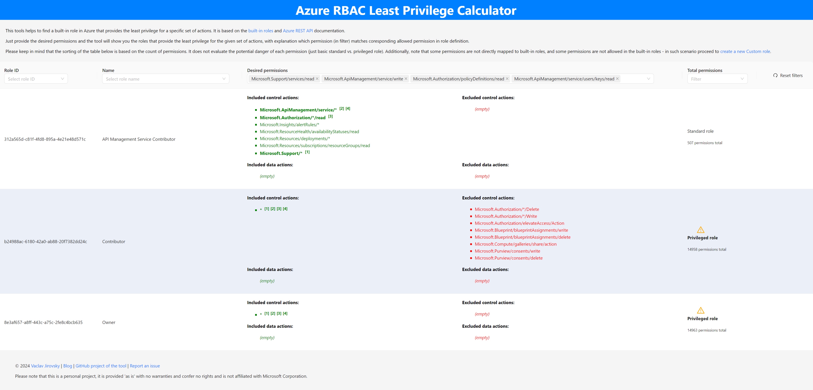

# Azure RBAC Least Privilege Calculator

This tool assists users in calculating the minimal Azure RBAC built-in role required for specific permissions. It daily retrieves from the Azure REST APIs the list of available RBAC built-in roles and possible permissions, enabling users to browse through the UI and determine the best-suited role.

Additionally, note that some permissions are not directly mapped to built-in roles, and some permissions are not allowed in the built-in roles - in such scenario proceed to create a new Azure Custom role.

## Usage

Just visit the URL [https://vjirovsky.github.io/azure-rbac-least-calculator/](https://vjirovsky.github.io/azure-rbac-least-calculator/) and select the permissions you need to assign. The tool will automatically filter out roles that either lack any of the requested permissions or exclude any specific permissions you've selected. Also the tool highlights which permissions in a role definition matches a requested permission.

The tool automatically generates a deeplink with the current filters applied, so you can share it with the selected values.

E.g.:
https://vjirovsky.github.io/azure-rbac-least-calculator/?permissions[]=Microsoft.Support%2Fservices%2Fread&permissions[]=Microsoft.ApiManagement%2Fservice%2Fwrite&permissions[]=Microsoft.Authorization%2FpolicyDefinitions%2Fread&permissions[]=Microsoft.ApiManagement%2Fservice%2Fusers%2Fkeys%2Fread

Please be aware that the sorting of the table below is determined by the number of permissions. It does not assess the potential risk associated with each permission, only distinguishing between basic standard and privileged roles..

## Disclaimer

Please note that this is a personal project, it is provided 'as is' with no warranties and confer no rights and is not affiliated with Microsoft Corporation.

## Building

In the project directory, you can run:

### `npm start`

Runs the app in the development mode.\
Open [http://localhost:3000](http://localhost:3000) to view it in your browser.

The page will reload when you make changes.\
You may also see any lint errors in the console.
